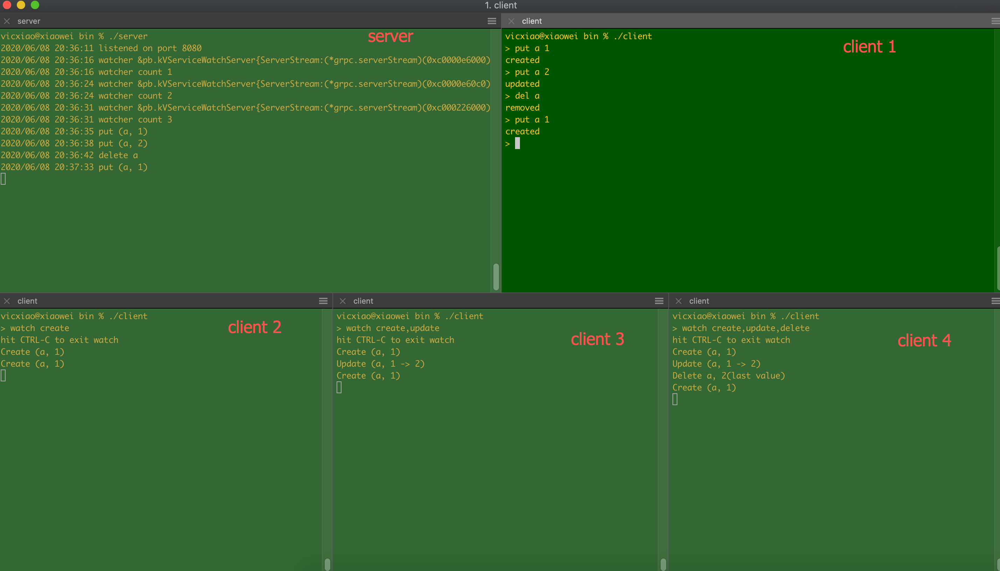

# golang watch 功能示例代码

server是一个简单key-value store, 支持put/del两类操作，产生对应三种类型的数据变更事件：创建、更新、删除。  
client 可以使用watch功能，接受关注的事件通知。

## 技术要点

1. grpc stream 实现长链接，使得服务端可以通知client。
2. server端实现消息广播机制，使得一个事件可以发送给所有client
3. server为每个client维护一个过滤器，过滤非关注事件

## 如何运行示例

`make all`
